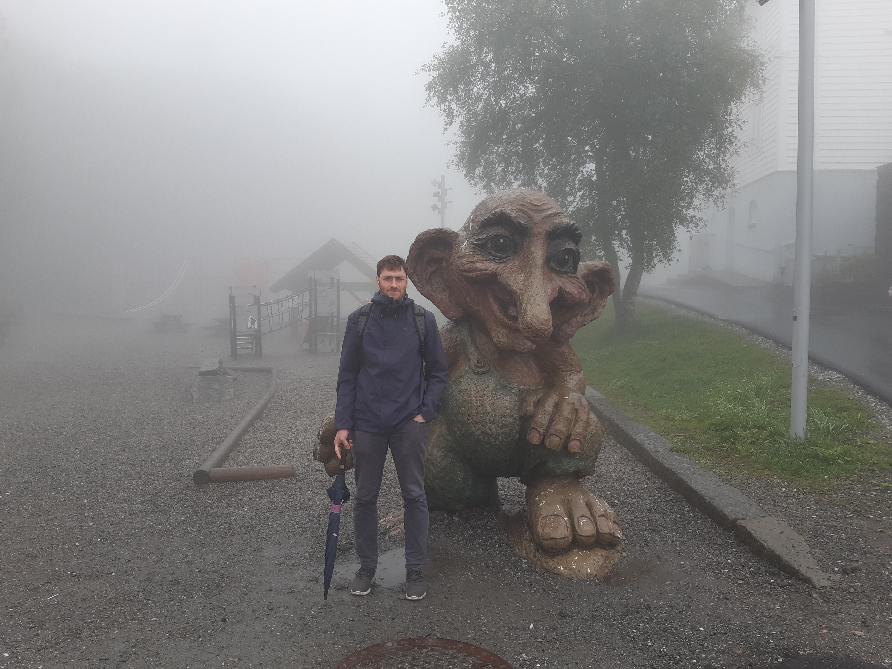

Welcome to my webpage!  

I am a postdoctoral research associate in applied mathematics at <b>Imperial College London</b>, working with <a href="https://www.imperial.ac.uk/people/d.holm" target="_blank">Prof. Darryl D. Holm</a>. I am also a guest researcher at the <b>Technical University of Munich (TUM)</b> in the group of <a href="https://multiscale.systems" target="_blank">Prof. Christian Kühn</a>.

<b>Research interests</b>
<ul>
  <li>Stochastic computational methods for fluid dynamics and magnetohydrodynamics</li>
  <li>Geometric (stochastic) integration</li>
  <li>Geometric numerical hydrodynamics</li>
  <li>Stochastic (turbulence) closure modelling</li>
  <li>Data assimilation</li>
</ul>

Previously, I was a postdoctoral researcher at Chalmers University of Technology (Sweden) in the group of <a href="https://klasmodin.github.io/" target="_blank">Prof. Klas Modin</a>. I completed my PhD at the University of Twente (The Netherlands) on stochastic computational models for geophysical fluid dynamics, under the supervision of <a href="https://people.utwente.nl/b.j.geurts" target="_blank">Prof. Bernard Geurts</a>.

  

### Recent News

<ul>
  
  
    <li><strong>{{ item.date | date: "%b %d, %Y" }}</strong> — {{ item.text }}</li>
  
</ul>